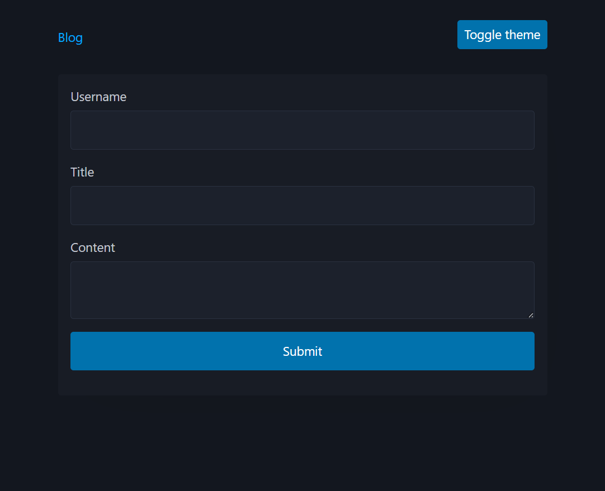
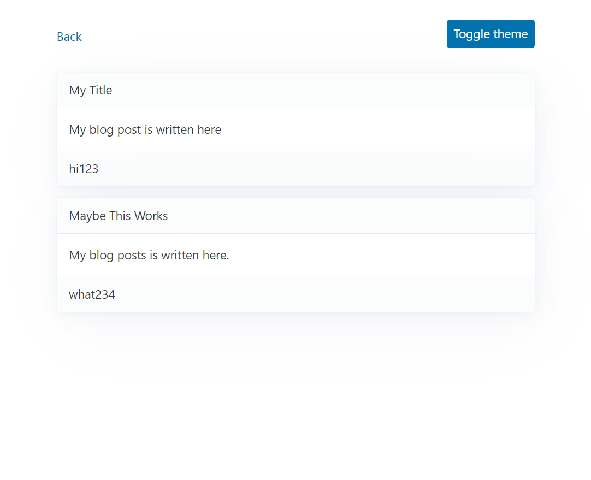

# My First Blog

- Uses CSS Framework - PicoCSS

- Local Storage is functional

- Multi-page website is functional. Back button takes you to the input Form.

- Using Javascript, the toggle button at top right can switch from Light/Dark mode. 

GitHub Repo: https://github.com/JLH-Owner/employee-payroll-tracker

Webpage Url: https://jlh-owner.github.io/employee-payroll-tracker/
